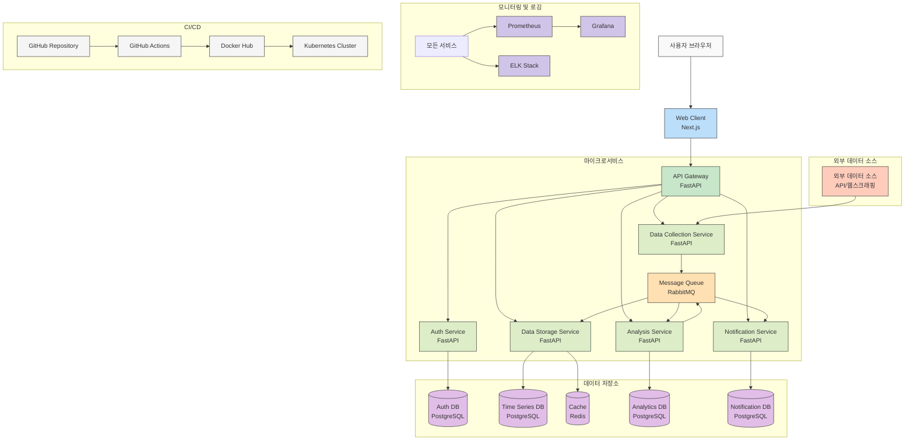
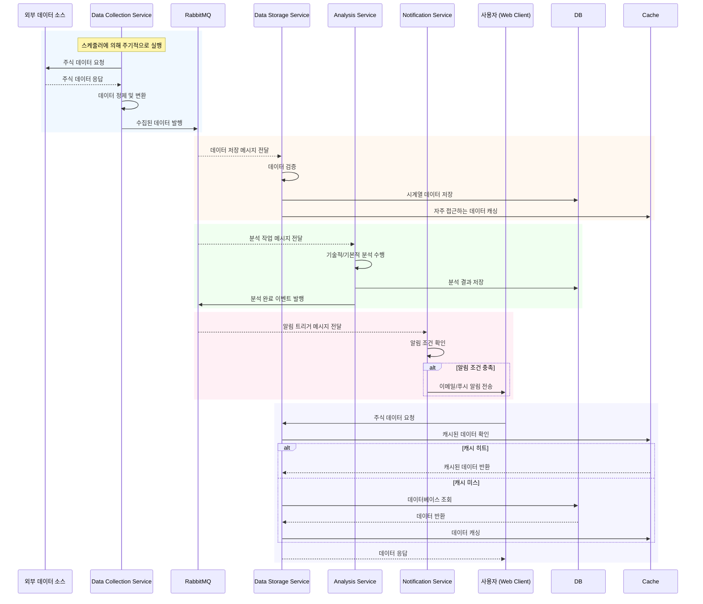
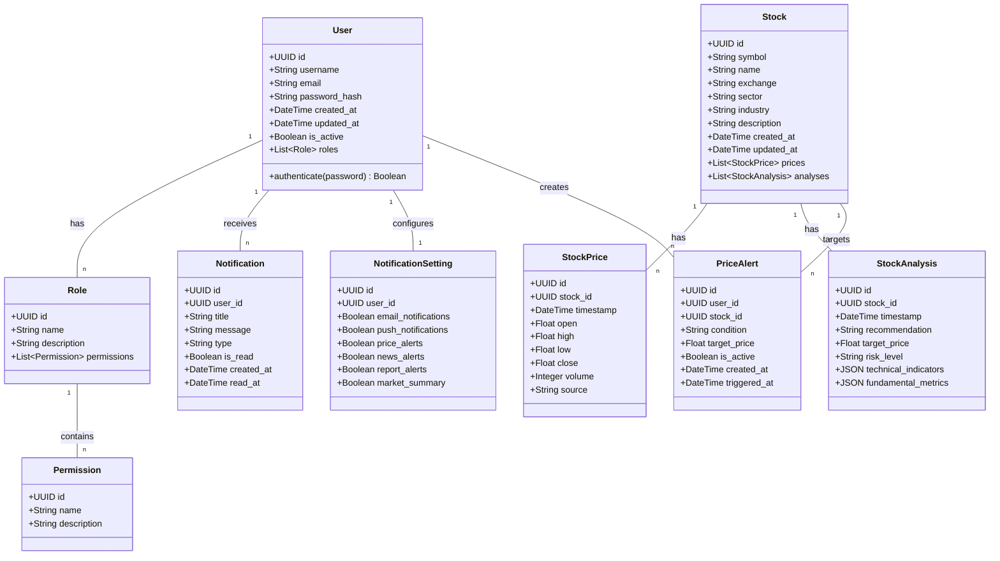

# New Data Collector

개선된 주식 데이터 수집 및 관리 백엔드 서비스입니다. 기존 Data Collector 프로젝트를 개선하여 성능, 확장성, 보안성을 강화했습니다.

## 주요 개선 사항

- **마이크로서비스 아키텍처** 도입으로 확장성 및 유지보수성 향상
- **비동기 처리** 강화로 성능 개선
- **데이터 소스 추상화** 레이어 구현으로 다양한 데이터 소스 지원
- **보안 강화** 및 인증 시스템 개선
- **모니터링 및 로깅 시스템** 도입
- **CI/CD 파이프라인** 구축
- **Next.js 기반 웹 클라이언트** 추가로 사용자 인터페이스 제공

## 기술 스택

- **언어**: Python 3.11
- **웹 프레임워크**: FastAPI
- **ORM**: SQLAlchemy
- **데이터베이스**: PostgreSQL (시계열 데이터 파티셔닝 적용)
- **캐싱**: Redis
- **메시지 큐**: RabbitMQ
- **태스크 큐**: Celery
- **컨테이너화**: Docker, Kubernetes
- **모니터링**: Prometheus, Grafana
- **로깅**: ELK Stack (Elasticsearch, Logstash, Kibana)
- **CI/CD**: GitHub Actions
- **프론트엔드**: Next.js, TypeScript, Tailwind CSS

## 아키텍처 개요

New Data Collector는 다음과 같은 마이크로서비스로 구성되어 있습니다:

1. **API Gateway Service**: 클라이언트 요청을 적절한 서비스로 라우팅
2. **Auth Service**: 사용자 인증 및 권한 관리
3. **Data Collection Service**: 다양한 소스에서 데이터 수집
4. **Data Storage Service**: 데이터 저장 및 관리
5. **Analysis Service**: 데이터 분석 및 지표 계산
6. **Notification Service**: 사용자 알림 관리
7. **Web Client**: Next.js 기반의 웹 클라이언트 인터페이스

각 서비스는 독립적으로 배포 가능하며, 서비스 간 통신은 REST API 또는 메시지 큐를 통해 이루어집니다.

## 시스템 아키텍처 다이어그램



### 데이터 수집 및 처리 흐름



### 주요 데이터 모델 구조



## 프로젝트 구조

```
new-data-collector/
├── docs/                       # 프로젝트 문서
│   ├── architecture/           # 아키텍처 문서
│   ├── api/                    # API 문서
│   └── development/            # 개발 가이드
├── services/                   # 마이크로서비스
│   ├── api-gateway/            # API Gateway 서비스
│   ├── auth-service/           # 인증 서비스
│   ├── data-collection-service/ # 데이터 수집 서비스
│   ├── data-storage-service/   # 데이터 저장 서비스
│   ├── analysis-service/       # 데이터 분석 서비스
│   ├── notification-service/   # 알림 서비스
│   └── web-client/             # Next.js 기반 웹 클라이언트
├── infrastructure/             # 인프라 설정
│   ├── docker/                 # Docker 설정
│   ├── kubernetes/             # Kubernetes 설정
│   ├── monitoring/             # 모니터링 설정
│   └── ci-cd/                  # CI/CD 파이프라인 설정
├── common/                     # 공통 라이브러리
│   ├── models/                 # 공통 모델
│   ├── utils/                  # 유틸리티 함수
│   └── clients/                # 외부 서비스 클라이언트
├── scripts/                    # 유틸리티 스크립트
├── .gitignore                  # Git 무시 파일 설정
└── .markdownlint.json          # 마크다운 린트 설정
```

## 설치 및 실행

### 요구 사항

- Docker 및 Docker Compose
- Kubernetes (선택 사항)
- Python 3.11 이상
- Node.js 18.0.0 이상 (웹 클라이언트용)

### 개발 환경 설정

```bash
# 저장소 클론
git clone https://github.com/your-username/new-data-collector.git
cd new-data-collector

# 가상 환경 설정 (선택 사항)
python -m venv venv
source venv/bin/activate  # Linux/Mac
# 또는
venv\Scripts\activate  # Windows

# 의존성 설치 (로컬 개발 시)
pip install -r requirements.txt

# Docker Compose로 개발 환경 실행
docker-compose -f infrastructure/docker/docker-compose.dev.yml up

# 웹 클라이언트 실행 (별도 터미널에서)
cd services/web-client
npm install
npm run dev
```

### 프로덕션 배포

```bash
# Kubernetes 배포
kubectl apply -f infrastructure/kubernetes/
```

## 개발 가이드

각 마이크로서비스는 독립적으로 개발 및 테스트할 수 있습니다. 서비스별 개발 가이드는 해당 서비스 디렉토리의 README.md 파일을 참조하세요.

### 코드 스타일

이 프로젝트는 다음과 같은 코드 스타일 가이드를 따릅니다:
- Python: PEP 8
- JavaScript/TypeScript: ESLint, Prettier
- 문서: Markdown 린트 규칙 (.markdownlint.json)

## 기여 가이드

프로젝트에 기여하기 위한 자세한 내용은 [CONTRIBUTING.md](docs/development/CONTRIBUTING.md)를 참조하세요.

## 라이센스

이 프로젝트는 MIT 라이센스 하에 배포됩니다. 자세한 내용은 [LICENSE](LICENSE) 파일을 참조하세요. 