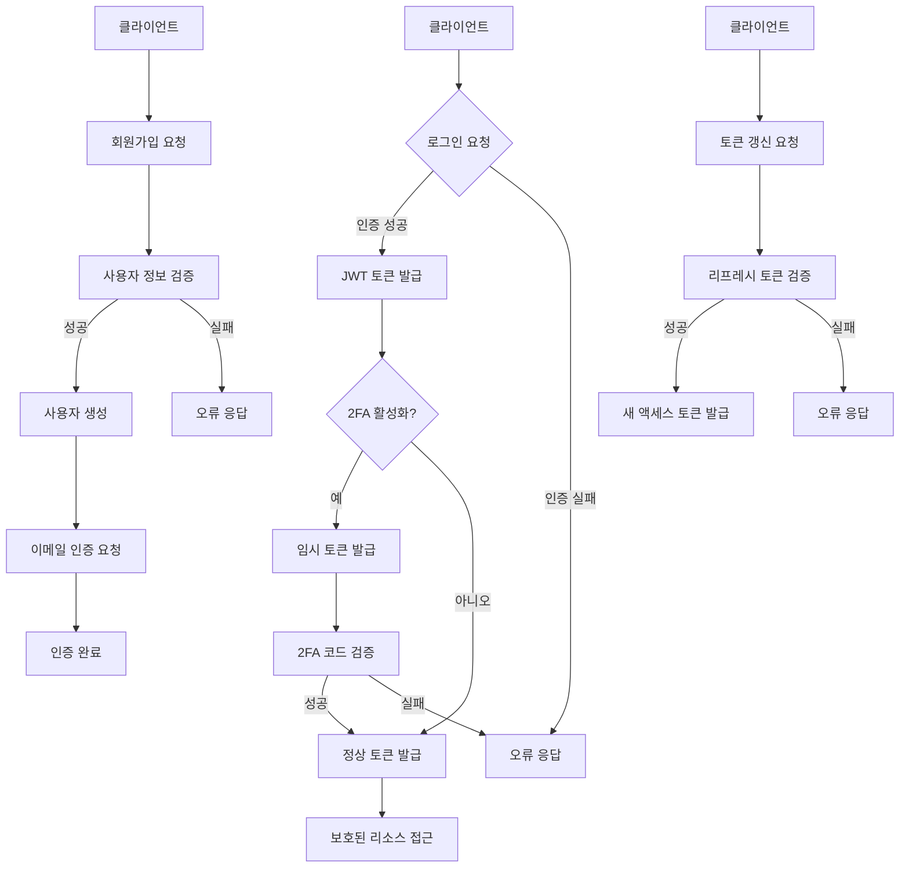

# 인증 서비스 (Auth Service)

인증 서비스는 New Data Collector 프로젝트의 사용자 인증 및 권한 관리를 담당하는 마이크로서비스입니다.

## 구조

```text
auth-service/
├── app/
│   ├── __init__.py
│   ├── config.py                # 설정 관리
│   ├── main.py                  # 애플리케이션 진입점
│   ├── models/                  # 모델
│   │   ├── __init__.py
│   │   └── user.py              # 사용자 모델
│   ├── schemas/                 # Pydantic 모델
│   │   ├── __init__.py
│   │   └── user.py              # 사용자 스키마
│   ├── services/                # 서비스
│   │   ├── __init__.py
│   │   └── auth.py              # 인증 서비스
│   ├── utils/                   # 유틸리티
│   │   ├── __init__.py
│   │   └── security.py          # 보안 유틸리티
│   ├── tests/                   # 테스트   
│   │   ├── __init__.py
│   │   └── test_auth.py         # 인증 테스트
│   ├── Dockerfile               # 프로덕션 Dockerfile
│   ├── Dockerfile.dev           # 개발 Dockerfile
│   ├── requirements.txt         # 기본 의존성
│   ├── requirements.dev.txt     # 개발 의존성
│   └── README.md                # 문서  
```

## 프로세스

인증 서비스의 주요 프로세스는 다음과 같습니다:



## 기능

- 사용자 등록 및 로그인
- JWT 기반 인증
- 역할 기반 접근 제어 (RBAC)
- 2단계 인증 (TOTP)
- 비밀번호 재설정
- 이메일 인증

## 기술 스택

- **언어**: Python 3.11
- **웹 프레임워크**: FastAPI
- **ORM**: SQLAlchemy
- **데이터베이스**: PostgreSQL
- **인증**: JWT, TOTP
- **컨테이너화**: Docker

## 설치 및 실행

### 로컬 개발 환경

1. 가상 환경 생성 및 활성화
   ```bash
   python -m venv venv
   source venv/bin/activate  # Linux/Mac
   venv\Scripts\activate  # Windows
   ```

2. 의존성 설치
   ```bash
   pip install -r requirements.txt
   ```

3. 환경 변수 설정
   `.env` 파일을 생성하고 필요한 환경 변수를 설정합니다.
   ```
   # 기본 설정
   PROJECT_NAME=Auth Service
   DEBUG=True
   
   # 데이터베이스 설정
   POSTGRES_SERVER=localhost
   POSTGRES_USER=postgres
   POSTGRES_PASSWORD=postgres
   POSTGRES_DB=auth_service
   POSTGRES_PORT=5432
   
   # JWT 설정
   JWT_SECRET_KEY=your-secret-key-here
   JWT_ALGORITHM=HS256
   ACCESS_TOKEN_EXPIRE_MINUTES=30
   REFRESH_TOKEN_EXPIRE_DAYS=7
   ```

4. 애플리케이션 실행
   ```bash
   uvicorn app.main:app --reload
   ```

### Docker 환경

1. Docker 이미지 빌드
   ```bash
   docker build -t auth-service .
   ```

2. Docker 컨테이너 실행
   ```bash
   docker run -d -p 8000:8000 --name auth-service auth-service
   ```

## API 문서

애플리케이션이 실행되면 다음 URL에서 API 문서를 확인할 수 있습니다:

- Swagger UI: http://localhost:8000/docs
- ReDoc: http://localhost:8000/redoc

## 주요 API 엔드포인트

### 인증 관련

- `POST /api/v1/auth/register`: 사용자 등록
- `POST /api/v1/auth/login`: 로그인
- `POST /api/v1/auth/refresh`: 토큰 갱신
- `POST /api/v1/auth/2fa/setup`: 2단계 인증 설정
- `POST /api/v1/auth/2fa/verify`: 2단계 인증 검증
- `POST /api/v1/auth/2fa/login`: 2단계 인증 로그인

### 사용자 관련

- `GET /api/v1/users/me`: 현재 사용자 정보 조회
- `PUT /api/v1/users/me`: 현재 사용자 정보 업데이트
- `PUT /api/v1/users/me/password`: 비밀번호 변경
- `GET /api/v1/users`: 사용자 목록 조회 (관리자 전용)
- `POST /api/v1/users`: 사용자 생성 (관리자 전용)
- `GET /api/v1/users/{user_id}`: 특정 사용자 정보 조회 (관리자 전용)
- `PUT /api/v1/users/{user_id}`: 특정 사용자 정보 업데이트 (관리자 전용)
- `DELETE /api/v1/users/{user_id}`: 특정 사용자 삭제 (관리자 전용)

## 개발 가이드

### 데이터베이스 마이그레이션

Alembic을 사용하여 데이터베이스 마이그레이션을 관리합니다.

1. 마이그레이션 초기화 (처음 한 번만)
   ```bash
   alembic init alembic
   ```

2. 마이그레이션 생성
   ```bash
   alembic revision --autogenerate -m "설명"
   ```

3. 마이그레이션 적용
   ```bash
   alembic upgrade head
   ```

### 테스트

```bash
pytest
```

코드 커버리지 보고서 생성:
```bash
pytest --cov=app
``` 