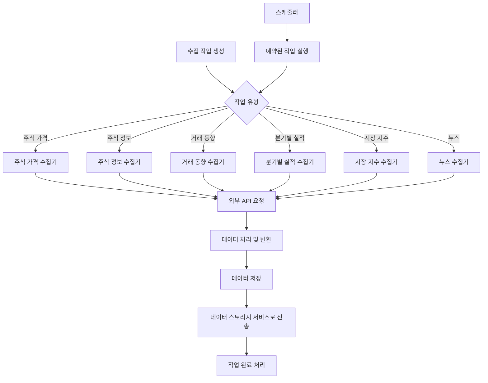

# 데이터 수집 서비스

주식 데이터 및 관련 정보를 수집하는 마이크로서비스입니다.

## 기능

- 주식 가격 데이터 수집
- 주식 기본 정보 수집
- 거래 동향 데이터 수집
- 분기별 실적 데이터 수집
- 시장 지수 데이터 수집
- 뉴스 데이터 수집
- 수집 작업 스케줄링 및 관리
- 수집 결과 저장 및 관리

## 기술 스택

- **언어**: Python 3.11
- **웹 프레임워크**: FastAPI
- **데이터베이스**: PostgreSQL
- **ORM**: SQLAlchemy
- **메시지 큐**: RabbitMQ
- **컨테이너화**: Docker, Docker Compose
- **비동기 처리**: asyncio, httpx

## 설치 및 실행

### 요구사항

- Docker 및 Docker Compose
- Python 3.11 이상 (로컬 개발 시)

### Docker를 사용한 실행

```bash
# 서비스 빌드 및 실행
docker-compose up -d

# 로그 확인
docker-compose logs -f
```

### 로컬 개발 환경 설정

```bash
# 가상 환경 생성 및 활성화
python -m venv venv
source venv/bin/activate  # Windows: venv\Scripts\activate

# 의존성 설치
pip install -r requirements.txt

# 환경 변수 설정 (.env 파일 생성)
cp .env.example .env
# .env 파일 편집

# 애플리케이션 실행
uvicorn app.main:app --reload
```

## API 문서

서비스 실행 후 다음 URL에서 API 문서를 확인할 수 있습니다:

- Swagger UI: http://localhost:8002/docs
- ReDoc: http://localhost:8002/redoc

## 프로젝트 구조

```
data-collection-service/
├── app/
│   ├── api/                 # API 엔드포인트
│   │   └── v1/              # API 버전 1
│   ├── collectors/          # 데이터 수집기
│   ├── core/                # 핵심 기능
│   ├── db/                  # 데이터베이스 관련
│   ├── models/              # 데이터베이스 모델
│   ├── schemas/             # Pydantic 스키마
│   ├── services/            # 비즈니스 로직
│   ├── tasks/               # 백그라운드 작업
│   └── utils/               # 유틸리티 함수
├── tests/                   # 테스트
├── .env.example             # 환경 변수 예시
├── docker-compose.yml       # Docker Compose 설정
├── Dockerfile               # Docker 빌드 설정
├── requirements.txt         # 의존성 목록
└── README.md                # 프로젝트 설명
```

## 프로세스



## 개발 가이드

### 새로운 수집기 추가

1. `app/collectors/` 디렉토리에 새 수집기 클래스 파일 생성
2. `BaseCollector` 클래스를 상속받아 구현
3. `collect()` 및 `store()` 메서드 구현
4. `app/collectors/factory.py`에 새 수집기 등록

### 테스트 실행

```bash
# 모든 테스트 실행
pytest

# 특정 테스트 실행
pytest tests/test_collectors/
```

## 향후 개선 사항

### 1. 성능 최적화

- **비동기 처리 개선**: 더 효율적인 비동기 작업 처리를 위한 코드 최적화
- **데이터베이스 인덱싱**: 자주 조회되는 필드에 대한 인덱스 추가
- **캐싱 도입**: Redis를 활용한 자주 요청되는 데이터 캐싱
- **배치 처리**: 대량 데이터 처리를 위한 배치 처리 메커니즘 구현

### 2. 확장성 개선

- **수평적 확장**: 여러 인스턴스로 확장 가능한 아키텍처 구현
- **작업 분산**: 작업 분산을 위한 로드 밸런싱 메커니즘 도입
- **마이크로서비스 통합**: 다른 마이크로서비스와의 통합 강화
- **API 게이트웨이 연동**: API 게이트웨이를 통한 중앙화된 접근 제공

### 3. 데이터 수집 기능 확장

- **더 많은 데이터 소스**: 추가 금융 데이터 제공업체 연동
- **실시간 데이터 수집**: 웹소켓을 활용한 실시간 시장 데이터 수집
- **소셜 미디어 데이터**: 트위터, 레딧 등의 소셜 미디어 감성 분석 데이터 수집
- **대체 데이터**: 위성 이미지, 웹 트래픽 등 대체 데이터 수집 기능 추가

### 4. 보안 강화

- **API 인증 강화**: OAuth2 또는 JWT 기반 인증 시스템 구현
- **데이터 암호화**: 민감한 데이터에 대한 암호화 적용
- **접근 제어**: 세분화된 권한 관리 시스템 구현
- **보안 감사**: 정기적인 보안 감사 및 취약점 스캔 자동화

### 5. 모니터링 및 관리 도구

- **대시보드 구현**: 수집 작업 모니터링을 위한 관리자 대시보드
- **알림 시스템 개선**: 다양한 채널(이메일, 슬랙, SMS)을 통한 알림 전송
- **로깅 강화**: 구조화된 로깅 및 로그 분석 도구 통합
- **성능 메트릭**: Prometheus 및 Grafana를 활용한 성능 메트릭 수집 및 시각화

### 6. 테스트 및 품질 관리

- **테스트 커버리지 확대**: 단위 테스트 및 통합 테스트 확대
- **부하 테스트**: 고부하 상황에서의 시스템 안정성 테스트
- **CI/CD 파이프라인**: 자동화된 테스트 및 배포 파이프라인 구축
- **코드 품질 도구**: SonarQube 등을 활용한 코드 품질 모니터링

## 라이선스

이 프로젝트는 MIT 라이선스 하에 배포됩니다.

## 공시정보 수집 기능 사용 예제

### 1. DART 시스템에서 공시정보 수집

```bash
curl -X POST "http://localhost:8000/api/v1/collection-tasks/" \
  -H "Content-Type: application/json" \
  -d '{
    "collection_type": "disclosure",
    "parameters": {
      "source": "dart",
      "api_key": "YOUR_DART_API_KEY",
      "start_date": "20230101",
      "end_date": "20230131",
      "corp_code": "",
      "disclosure_type": ""
    },
    "scheduled_at": null,
    "is_recurring": false
  }'
```

### 2. KRX에서 공시정보 수집

```bash
curl -X POST "http://localhost:8000/api/v1/collection-tasks/" \
  -H "Content-Type: application/json" \
  -d '{
    "collection_type": "disclosure",
    "parameters": {
      "source": "krx",
      "start_date": "20230101",
      "end_date": "20230131"
    },
    "scheduled_at": null,
    "is_recurring": false
  }'
```

### 3. 주기적인 공시정보 수집 설정 (매일 오전 9시)

```bash
curl -X POST "http://localhost:8000/api/v1/collection-tasks/" \
  -H "Content-Type: application/json" \
  -d '{
    "collection_type": "disclosure",
    "parameters": {
      "source": "dart",
      "api_key": "YOUR_DART_API_KEY"
    },
    "scheduled_at": "2023-03-01T09:00:00Z",
    "is_recurring": true,
    "interval_minutes": 1440
  }'
```

### 4. 특정 회사의 공시정보만 수집

```bash
curl -X POST "http://localhost:8000/api/v1/collection-tasks/" \
  -H "Content-Type: application/json" \
  -d '{
    "collection_type": "disclosure",
    "parameters": {
      "source": "dart",
      "api_key": "YOUR_DART_API_KEY",
      "corp_code": "00126380"
    },
    "scheduled_at": null,
    "is_recurring": false
  }'
```

### 5. 특정 유형의 공시정보만 수집

```bash
curl -X POST "http://localhost:8000/api/v1/collection-tasks/" \
  -H "Content-Type: application/json" \
  -d '{
    "collection_type": "disclosure",
    "parameters": {
      "source": "dart",
      "api_key": "YOUR_DART_API_KEY",
      "disclosure_type": "A"
    },
    "scheduled_at": null,
    "is_recurring": false
  }'
```

> 참고: DART API의 공시유형(disclosure_type) 코드
> - A: 정기공시
> - B: 주요사항보고
> - C: 발행공시
> - D: 지분공시
> - E: 기타공시
> - F: 외부감사관련
> - G: 펀드공시
> - H: 자산유동화
> - I: 거래소공시
> - J: 공정위공시 