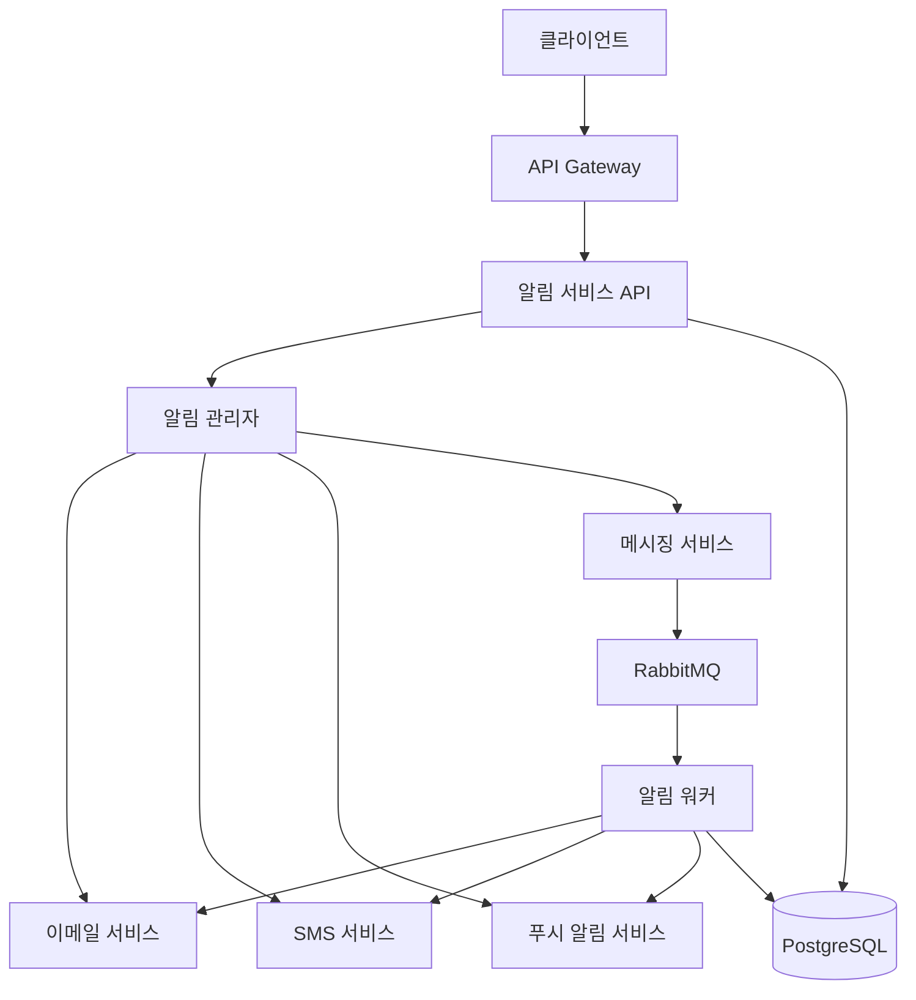
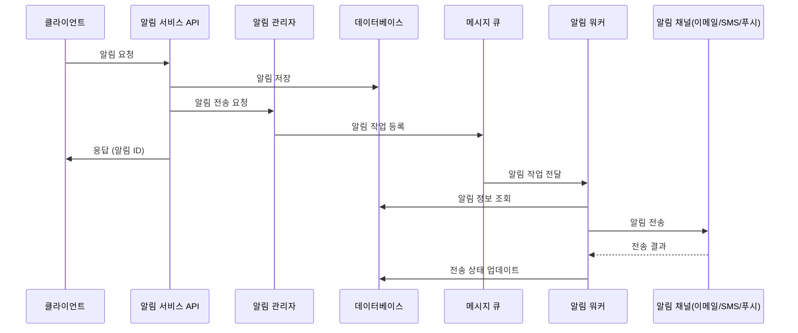

# 알림 서비스 (Notification Service)

알림 서비스는 New Data Collector 시스템의 다양한 알림을 관리하고 전송하는 마이크로서비스입니다. 이메일, SMS, 푸시 알림 등 다양한 채널을 통해 사용자에게 알림을 전달합니다.

## 주요 기능

- **다중 채널 알림**: 이메일, SMS, 푸시 알림 등 다양한 채널을 통한 알림 전송
- **알림 관리**: 알림 생성, 조회, 업데이트, 삭제 기능
- **알림 상태 추적**: 알림 전송 상태 및 읽음 상태 추적
- **템플릿 기반 알림**: 사전 정의된 템플릿을 사용한 알림 생성
- **메시지 큐 통합**: RabbitMQ를 통한 비동기 알림 처리

## 기술 스택

- **언어**: Python 3.11
- **웹 프레임워크**: FastAPI
- **데이터베이스**: PostgreSQL
- **ORM**: SQLAlchemy (비동기 지원)
- **메시지 큐**: RabbitMQ
- **캐싱**: Redis
- **컨테이너화**: Docker, Docker Compose
- **이메일 서비스**: SMTP (개발 환경에서는 MailHog)

## 시스템 아키텍처



## 알림 프로세스



## 설치 및 실행

### 요구사항

- Docker 및 Docker Compose
- Python 3.11 이상 (로컬 개발 시)

### 환경 변수 설정

`.env` 파일을 생성하고 필요한 환경 변수를 설정합니다. `.env.example` 파일을 참고하세요.

### Docker Compose로 실행

```bash
# 서비스 빌드 및 실행
docker-compose up -d

# 로그 확인
docker-compose logs -f notification-service
```

### 로컬 개발 환경 설정

```bash
# 가상 환경 생성 및 활성화
python -m venv venv
source venv/bin/activate  # Windows: venv\Scripts\activate

# 의존성 설치
pip install -r requirements.txt

# 개발 서버 실행
uvicorn app.main:app --reload --host 0.0.0.0 --port 8000
```

## API 문서

서비스 실행 후 다음 URL에서 API 문서를 확인할 수 있습니다:

- Swagger UI: `http://localhost:8000/docs`
- ReDoc: `http://localhost:8000/redoc`

## 주요 API 엔드포인트

| 엔드포인트                             | 메서드    | 설명          |
|-----------------------------------|--------|-------------|
| `/api/v1/notifications`           | GET    | 알림 목록 조회    |
| `/api/v1/notifications`           | POST   | 알림 생성       |
| `/api/v1/notifications/{id}`      | GET    | 특정 알림 조회    |
| `/api/v1/notifications/{id}`      | PATCH  | 알림 업데이트     |
| `/api/v1/notifications/{id}`      | DELETE | 알림 삭제       |
| `/api/v1/notifications/{id}/read` | POST   | 알림을 읽음으로 표시 |
| `/api/v1/notifications/send`      | POST   | 알림 즉시 전송    |

## 개발 가이드

### 프로젝트 구조

```
notification-service/
├── app/
│   ├── api/
│   │   ├── deps.py
│   │   └── v1/
│   │       ├── api.py
│   │       └── endpoints/
│   │           └── notifications.py
│   ├── core/
│   │   └── config.py
│   ├── db/
│   │   ├── init_db.py
│   │   └── session.py
│   ├── models/
│   │   └── notification.py
│   ├── schemas/
│   │   └── notification.py
│   ├── services/
│   │   ├── email_service.py
│   │   ├── messaging_service.py
│   │   ├── notification_manager.py
│   │   ├── push_notification_service.py
│   │   └── sms_service.py
│   ├── tasks/
│   │   └── worker.py
│   ├── templates/
│   │   └── email/
│   │       └── base.html
│   ├── utils/
│   │   └── templates.py
│   └── main.py
├── tests/
│   ├── api/
│   │   └── test_notifications.py
│   └── services/
│       └── test_notification_service.py
├── .env.example
├── Dockerfile
├── docker-compose.yml
├── requirements.txt
└── README.md
```

### 새로운 알림 채널 추가하기

1. `app/services/` 디렉토리에 새로운 서비스 모듈 생성
2. `NotificationManager` 클래스에 새 채널 지원 추가
3. 필요한 경우 모델 및 스키마 업데이트

### 테스트 실행

```bash
# 모든 테스트 실행
pytest

# 특정 테스트 실행
pytest tests/api/test_notifications.py
```

## 모니터링 및 로깅

- 로그는 `/var/log/notification-service/` 디렉토리에 저장됩니다.
- Prometheus 및 Grafana를 통한 모니터링이 구성되어 있습니다.

## 문제 해결

일반적인 문제 및 해결 방법:

- **데이터베이스 연결 오류**: 환경 변수 설정 확인
- **메시지 큐 연결 오류**: RabbitMQ 서비스 실행 여부 확인
- **이메일 전송 실패**: SMTP 설정 확인

## 라이센스

이 프로젝트는 MIT 라이센스 하에 배포됩니다. 